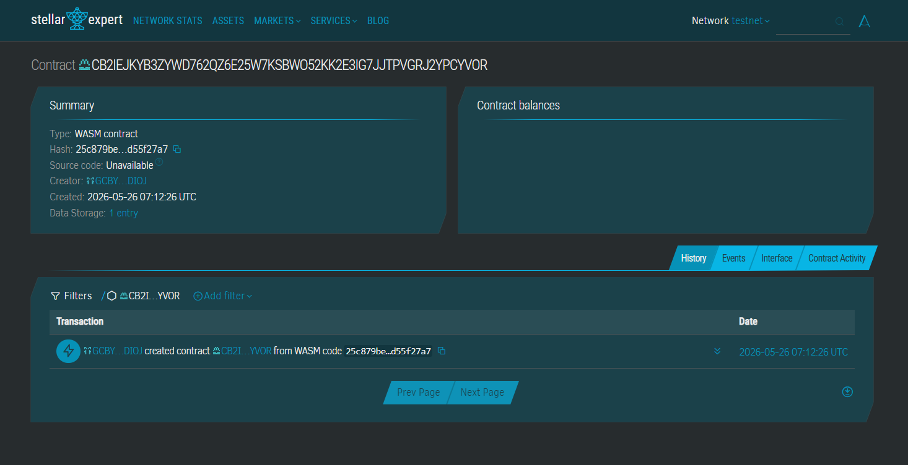

# SariPay B2B

## CONTRACT ID:
CDCYQTQY5TETNSKHGNCJQXDPEUTDAQY4AONAQQPTBLICTDVAVE3VOPDU

## CONTRACT LINK:
https://stellar.expert/explorer/testnet/contract/CDCYQTQY5TETNSKHGNCJQXDPEUTDAQY4AONAQQPTBLICTDVAVE3VOPDU




SariPay B2B is a decentralized, secure supply chain micro-escrow smart payment dApp optimized for small shop owners and informal neighborhood merchants in Southeast Asia.

## Problem & Solution
Micro-merchants face severe capital lockups and stocking delays because fiat banking transfers take days or require risky cash-on-delivery routines. SariPay B2B handles this friction by locking stablecoins in a transparent, sub-second escrow smart contract right at order placement, signaling distributors that funding is safe and releasing the money automatically upon confirmed delivery.

## Timeline
* **Day 1:** Core Soroban contract implementation and localized mock state engine verification.
* **Day 2:** Client UI portal binding and Freighter wallet asset channel integration.

## Stellar Features Used
* **USDC Payments:** Zero-volatility transactional value transfer matching real inventory.
* **Soroban Smart Contracts:** Self-contained, programmatic state management for escrow deposits.
* **Trustlines:** Automated receipt authorization validation.

## Vision and Purpose
To empower underbanked corner store owners across growing regions by bringing instant, institutional-grade commercial supply chain liquidity down to micro-retail footprints.

## Prerequisites
* Rust v1.84.0+
* Target `wasm32v1-none`
* Stellar CLI

## How to Build
```bash
stellar contract build
